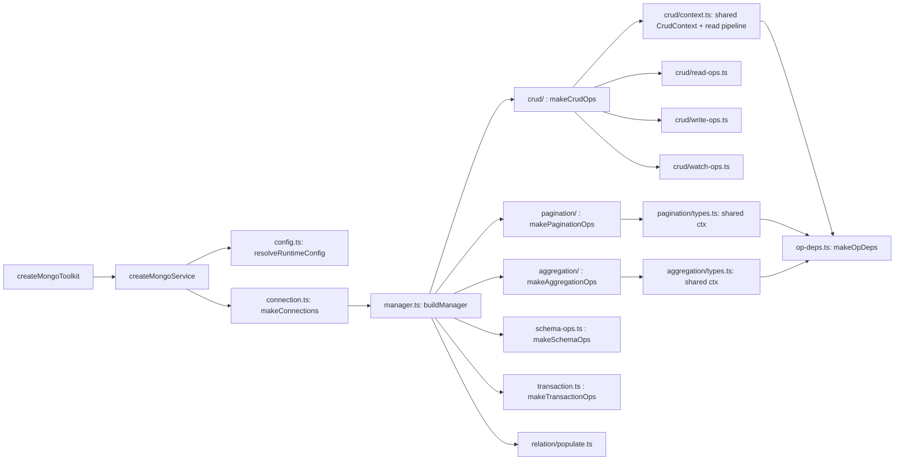

# STRUCTURE — ninox


```
index.ts                       # runnable smoke demo (bun run index.ts)
src/
  index.ts                     # public barrel (named exports)
  types.ts                     # DBClientDefinition / CollectionDefinition / Extract* inference
  mongo-helpers.ts             # withRetry (transient errors) + withTransaction
  capabilities.ts              # transaction capability probe + env override
  graceful-transaction.ts      # transaction-or-null fallback wrapper
  toolkit.ts                   # createMongoToolkit = service + migrations

  errors/                      # error taxonomy (moved from root errors.ts)
    classes.ts                 # AppError/DomainError/InfraError/BadRequest + ERROR_HTTP_STATUS + guards
    transient.ts               # TRANSIENT_MONGO_ERROR_CODES (frozen ReadonlySet) + transient detection
    driver-map.ts              # mapMongoDriverError + extractValidationPaths
    http-status.ts             # httpStatusForError + serializeError
    index.ts                   # barrel (all imports keep resolving via './errors')

  migrations/                  # file-based migration runner (moved from root migrations.ts)
    types.ts                   # MigrationContext / MigrationModule / Runner types + constants
    files.ts                   # discovery / load / next-number (pure fs helpers)
    journal.ts                 # _migrations claim-based journal (atomic, crash-safe)
    index.ts                   # createMongoMigrationRunner (orchestrates files + journal)

  schema/                      # ★ typed schema DSL → $jsonSchema (the core feature)
    types.ts                   # field builders (s.*, incl. s.jsonSchema escape hatch) + Chainable modifiers
    collections.ts             # ★ defineCollection / defineCollections — schema-driven names
    infer.ts                   # InferField / InferDoc (TS type from schema)
    json-schema.ts             # MongoJsonSchema fragment type (shared by DSL + converter)
    to-mongo-schema.ts         # toMongoSchema / toMongoValidator ($jsonSchema conversion)
    validate-doc/              # ★ runtime read-side drift check: validateDoc(schema, doc) → DriftIssue[]
      types.ts                 # DriftMode / DriftIssue / DriftIssueCode
      helpers.ts               # value-level checks (numeric bounds, bsonType, reserved fields)
      field-validators.ts      # ★ per-kind validator registry (functional replacement for the switch)
      validate.ts              # dispatch + object traversal + validateDoc
      index.ts
    index.ts

  repository/                  # ★ optional domain-typed wrapper over a manager
    repository.ts              # createRepository(manager, collection) — getById/create/page/populate…

  shared/                      # backend-neutral helpers
    constants.ts               # DEFAULT_MAX_LIMIT / DEFAULT_FIND_LIMIT
    pagination-math.ts         # normalizePageLimit
    pagination-result.ts       # buildPaginationResult / PaginationResult
    soft-delete.ts             # buildMongoActiveFilter / mergeMongoActiveFilter
    strip-primary-key.ts       # stripDocumentId
    merge-filters.ts           # mergeMongoFilters
    filter-types.ts            # FilterInput (strict, schema-typed filter)
    keyset.ts                  # ★ keyset pagination: buildKeysetFilter + cursor codec
    types.ts                   # RemoveIndexSignature / GeoPoint
    index.ts

  utils/                       # zero-dep utilities
    lru.ts                     # hand-rolled LRU
    logger.ts                  # LoggerLike + console/noop loggers
    timeout.ts                 # withTimeout / sleep / sleepJittered
    hash.ts                    # stableStringify / stableHash (cache keys)
    memoize.ts                 # createCached(Async)Factory (in-flight dedup) — renamed from cache.ts
    clone.ts                   # cloneDeep (BSON-aware: Date/ObjectId/RegExp)
    index.ts

  service/                     # op factories → one manager per DB
    index.ts                   # createMongoService (thin composition root) + MongoService type
    config.ts                  # MongoServiceConfig + resolveCache + resolveRuntimeConfig
    manager.ts                 # ★ buildManager (spreads every make*Ops) + CollectionManager type
    health.ts                  # health() + HealthReport / DbHealthResult
    connection.ts              # one MongoClient per URL + rollback-on-failure
    connection-uri.ts          # normalizeMongoUrl (moved from root)
    collection-name.ts         # logical → physical name resolution (moved from root)
    query-options.ts           # SDK vs driver option split
    crud-op.ts                 # defineCrudOp (resolve → trace → retry)
    op-deps.ts                 # ★ shared makeOpDeps ({trace, meta}) — deduped across factories
    trace-db-op.ts             # structured start/ok/error logging
    crud/                      # ★ makeCrudOps — composed from three op groups + shared context
      context.ts               # CrudContext: read() pipeline (cache/dedup/drift) + timestamps + helpers
      read-ops.ts              # getOne/getOneOrFail/findMany/findManyCursor/findActive*/count/distinct/estimated
      write-ops.ts             # insert*/update*/findOneAnd*/delete*/softDelete/upsert/bulk*/updateWithVersion
      watch-ops.ts             # watchCollection + query() (fluent builder entry)
      index.ts                 # makeCrudOps = spread of the three groups + CrudOps type
    pagination/                # ★ makePaginationOps
      types.ts                 # PaginationConfig / CursorPaginationConfig / CursorPage + ctx
      offset.ts                # paginateFlexible ($facet — single round-trip with totals)
      cursor.ts                # paginateCursor (keyset — O(log n) per page)
      index.ts                 # makePaginationOps = spread of the two strategies
    aggregation/               # ★ makeAggregationOps
      types.ts                 # GroupByConfig / DateRangeConfig / LookupConfig / PipelineCustomization + ctx
      helpers.ts               # mergeAggOptions + DATE_PART_FORMATS + collectAggSources / isCacheablePipeline
      cached-read.ts           # createCachedAggregate — write-through cache + dedup for materialized results
      aggregate.ts             # aggregate (callback stages) + pipeline (typed builder)
      group.ts                 # groupBy + dateRangeAnalysis
      text-search.ts           # textSearch ($text / $regex, $facet paged)
      lookup-join.ts           # lookupJoin ($lookup + optional $unwind)
      index.ts                 # makeAggregationOps = spread of the four groups
    aggregation-stages.ts      # buildAggregationStages (collection-typed callback stages + $geoNear)
    aggregation-pipeline.ts    # regex/$text search stage builders
    pipeline-builder.ts        # ★ PipelineBuilder — chained, fully type-safe db.pipeline() (+ $geoNear)
    pipeline-types.ts          # ★ type model: Projection/Grouped/Unwound/LookupSpecFor/FacetSpec/GeoNearSpec/…
    schema-ops.ts              # makeSchemaOps (createSchema/updateSchema + indexes)
    drift.ts                   # ★ shared drift checker (report/throw on schema drift for read ops)
    transaction.ts             # makeTransactionOps (transaction/migrate)
    update-format.ts           # formatUpdateFilter ($set wrap)
    update-types.ts            # UpdateInput / UpdateOperators (schema-typed update payloads)
    cache-invalidation.ts      # CacheInvalidator — cacheWatch change-stream invalidation

  query-builder/               # fluent, lazy, schema-typed query builder
    query-builder.ts           # .where/.or/.sort/.limit/.select → .one/.many/.cursor/...

  loader/                      # ★ perf: batching
    dataloader.ts              # DataLoader (microtask flush, batch, cache, keyOf)

  relation/                    # ★ perf: N+1 elimination
    relation.ts                # belongsTo / hasMany / manyToMany (schema-validated, typed as fields)
    populate.ts                # makePopulator → batched $in population

  cache/                       # ★ perf: caching
    query-cache.ts             # LRU + TTL + per-collection (+multi-source) invalidation
    in-flight.ts               # InFlight (concurrent identical query coalescing)
    hot-cache/                 # ★ createHotCache — opt-in LRU read cache (split by strategy)
      types.ts                 # HotCacheOptions / HotQueryConfig / stats types + constants
      size.ts                  # estimateSize (BSON-aware byte probe for maxValueBytes)
      ticker.ts                # RefreshTicker — standalone background-refresh interval
      watcher.ts               # WatchCoordinator — replica change-stream watchers
      index.ts                 # HotCache coordinator + createHotCache + public API
    index.ts

  hooks/                       # lifecycle middleware
    hooks.ts                   # HookMap / runHooks

tests/                         # bun:test suites (see README)
  pipeline.test.ts             # runtime suite for the typed aggregation pipeline
  agg-cache.test.ts            # aggregation caching (write-through, joins, bypasses, dedup)
  hot-cache.test.ts            # HotCache unit + standalone ticker + replica fallback
  hot-cache-mongo.test.ts      # HotCache real-Mongo data-integrity / no-side-effects
  hot-cache-resync.test.ts     # HotCache replica e2e — consumer outage → cache resync
bench/
  run-bench.ts                 # optimization harness → results/summary.json
  results/summary.json         # latest benchmark output
examples/                      # runnable live-Mongo examples (bun run examples/<file>.ts)
  shared/schema.ts             # canonical schema registry (defineCollections)
  shared/setup.ts              # connect/close helpers (unique DB per example)
  01-crud.ts … 09-perf-defaults.ts
  10-typed-pipeline.ts         # db.pipeline() — type-safe aggregation
  11-timestamps.ts             # auto createdAt/updatedAt
  12-keyset-pagination.ts      # paginateCursor
  13-geo.ts                    # s.geoPoint() + $geoNear
  14-repository.ts             # createRepository()
  15-hot-cache.ts              # global HotCache (replica watch / standalone ticker)
  16-hooks.ts                  # per-collection lifecycle hooks
  17-crud-advanced.ts          # bulkWrite/bulkUpsert/distinct/replaceOne/…
  18-health-watch.ts           # service.health() + eachDb + watchCollection
  19-text-search.ts            # textSearch ($text/$regex) + lookupJoin
  20-cache-watch.ts            # cacheWatch: change-stream cache invalidation
```

## Data flow

```
createMongoToolkit(dbClients, config)
  └─ createMongoService            (service/index.ts — thin composition root)
       ├─ resolveRuntimeConfig     (service/config.ts: env + cache/dedup/drift policy)
       └─ makeConnections          (service/connection.ts: one MongoClient per URL)
            └─ buildManager        (service/manager.ts: spreads every make*Ops)
                 ├─ makeCrudOps        → CRUD (cache/dedup/hooks aware)  [service/crud/]
                 ├─ makePaginationOps  → paginateFlexible / paginateCursor [service/pagination/]
                 ├─ makeAggregationOps → groupBy/textSearch/…/aggregate   [service/aggregation/]
                 ├─ makeSchemaOps      → createSchema/updateSchema
                 ├─ makeTransactionOps → transaction/migrate
                 ├─ populate           → DataLoader-batched relations
                 └─ client             → raw Db() escape hatch
```



Every op funnels through `defineCrudOp` = `resolveQueryOptions` (SDK vs driver)
→ `traceDbOp` (structured logs) → `withRetry` (transient-only). Each op factory
builds its `{ trace, meta }` deps once via the shared `makeOpDeps`
(`service/op-deps.ts`) instead of duplicating it. CRUD reads go through `read()`
which layers the optional query cache and in-flight dedup on top.
